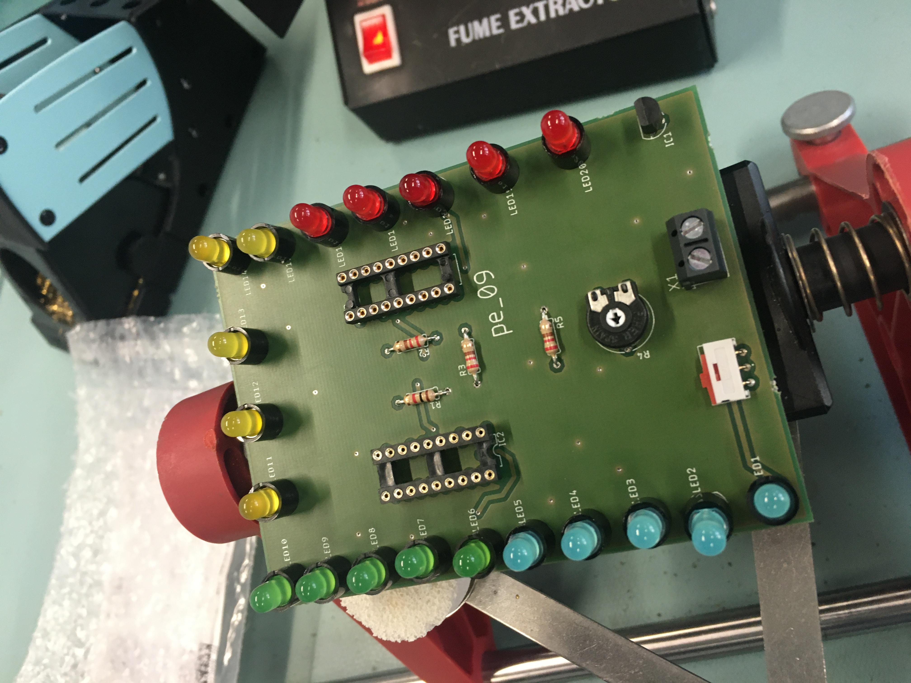
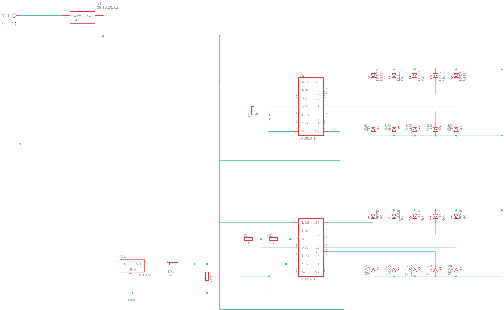
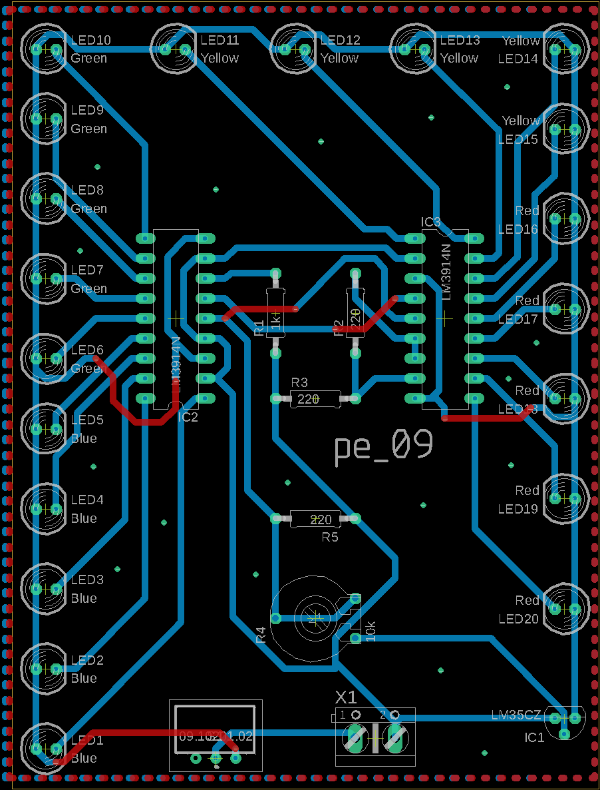

# MLT 5000

Multicolored LED thermometer we're creatively calling the  **MLT 5000**. Purely analog functionality with temperature sensor outputting signal to two cascading display ICs

## Schema

## Credit
F.Barraza Castillo
E.Attah-Mensah
